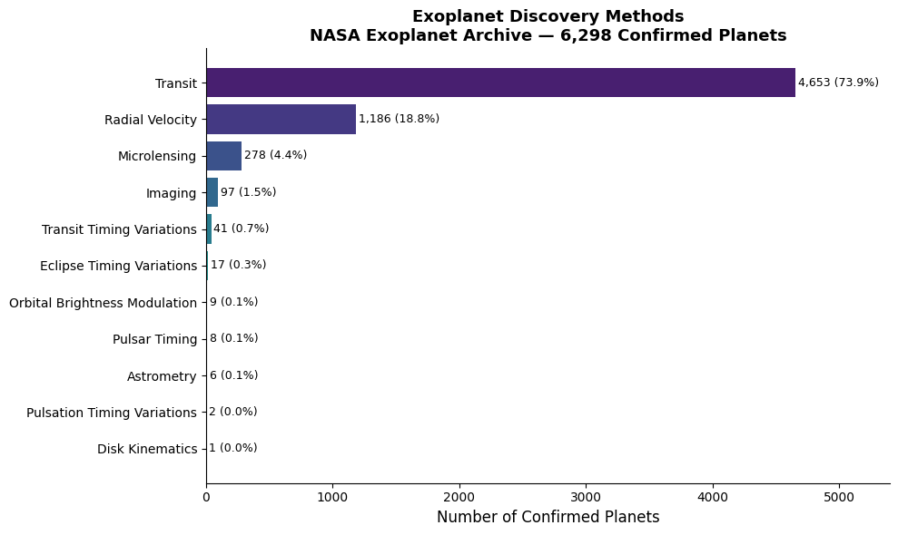
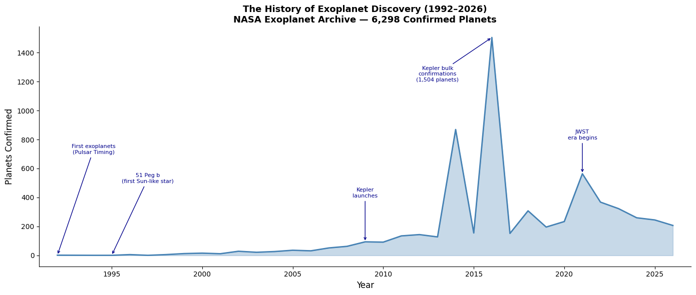
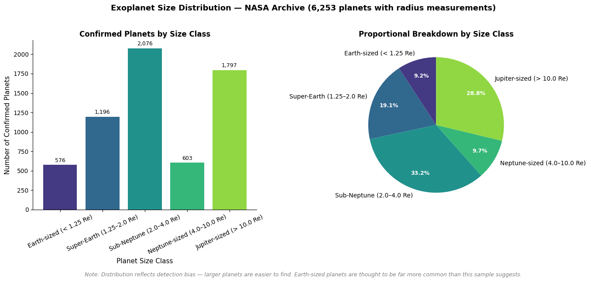
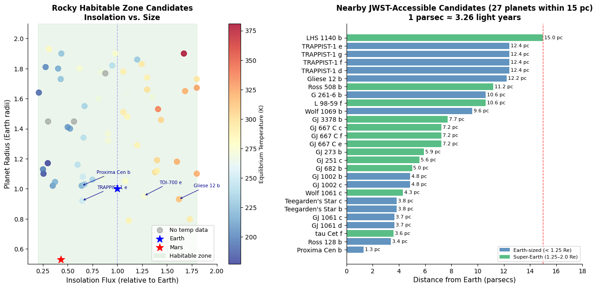

# NASA Exoplanet Archive — Data Explorer
### Python + SQL Analysis of 6,298 Confirmed Exoplanets

**Author:** Emma Follis  
**Data source:** [NASA Exoplanet Archive](https://exoplanetarchive.ipac.caltech.edu)  
**Tools:** Python, SQL (SQLite), pandas, matplotlib, seaborn  
**Last updated:** June 2026

[](https://colab.research.google.com/drive/1f3KCuh7kHz8Zc8wl05GJ2-_Tikv5rXtE?usp=sharing)

---

## Overview

This project explores the NASA Exoplanet Archive's confirmed planets table using Python and SQL. 
Starting from a raw CSV of 6,298 confirmed exoplanets across 84 measured variables, the analysis 
builds a SQLite database, runs structured queries, and produces professional visualizations that 
tell the story of exoplanet science — from the first two planets discovered in 1992 to the 
JWST era of atmospheric characterization beginning today.

The analysis covers four key questions in exoplanet demographics:

1. How were these planets found?
2. How has the discovery rate changed over time?
3. What sizes of planets have we confirmed?
4. Which confirmed planets are potentially habitable and reachable by JWST?

---

## Key Findings

**Discovery methods:** Transit dominates at 73.9% of all confirmed planets, reflecting the 
impact of NASA's Kepler and TESS missions. Radial Velocity accounts for 18.8%, with nine 
additional methods making up the remainder.

**Discovery timeline:** The field grew slowly from 1992 to 2009, then accelerated dramatically 
with Kepler's launch. Two bulk confirmation events in 2014 (869 planets) and 2016 (1,504 planets) 
transformed the confirmed planet catalog overnight.

**Size distribution:** Sub-Neptunes (2–4 Earth radii) are the most common confirmed planet type 
at 33.2%, followed by Jupiter-sized planets at 28.8%. Earth-sized planets account for only 9.2% 
of confirmed planets — a detection bias, not a reflection of their true abundance in the galaxy.

**Habitable zone candidates:** 58 confirmed planets meet conservative habitable zone and rocky 
planet criteria. Of these, 27 are within 15 parsecs of Earth and accessible to JWST atmospheric 
characterization. The nearest — Proxima Centauri b — is just 1.3 parsecs (4.2 light years) away.

---

## Visualizations

### Discovery Methods


### Discovery Timeline (1992–2026)


### Planet Size Distribution


### Habitable Zone Candidates


---

## Repository Structure
```
NASA_Exoplanet_Explorer/

├── NASA_Exoplanet_Explorer.ipynb    # Full analysis notebook

├── discovery_methods.png            # Query 1 visualization

├── discovery_timeline.png           # Query 2 visualization

├── size_distribution.png            # Query 3 visualization

├── habitable_zone_candidates.png    # Query 4 visualization

└── README.md                        # This file
```
---

## How to Run

**Option 1 — Google Colab (recommended):**  
Click the Open in Colab badge above. Download the confirmed planets table from the 
[NASA Exoplanet Archive](https://exoplanetarchive.ipac.caltech.edu/cgi-bin/TblView/nph-tblView?app=ExoTbls&config=PSCompPars) 
and upload it when prompted.

**Option 2 — Local:**  
```bash
pip install pandas matplotlib seaborn
jupyter notebook NASA_Exoplanet_Explorer.ipynb
```
Download the data CSV from the NASA Exoplanet Archive link above.

---

## Data Notes

- Dataset: NASA Exoplanet Archive Planetary Systems Composite Parameters table
- Retrieved: June 2026
- 6,298 confirmed planets, 84 measured variables
- Data completeness varies by column — see notebook for full quality assessment
- Detection bias significantly affects size and type distributions

---

## About

Built as part of a scientific data analysis portfolio by Emma Follis, a data analyst 
with a background in Earth and Planetary Science. Currently completing an M.S. in Space 
Studies at American Public University while contributing to NASA's Exoplanet Watch 
citizen science program.

[LinkedIn](www.linkedin.com/in/emma-follis) | 
[GitHub](https://github.com/AstroAstra)
